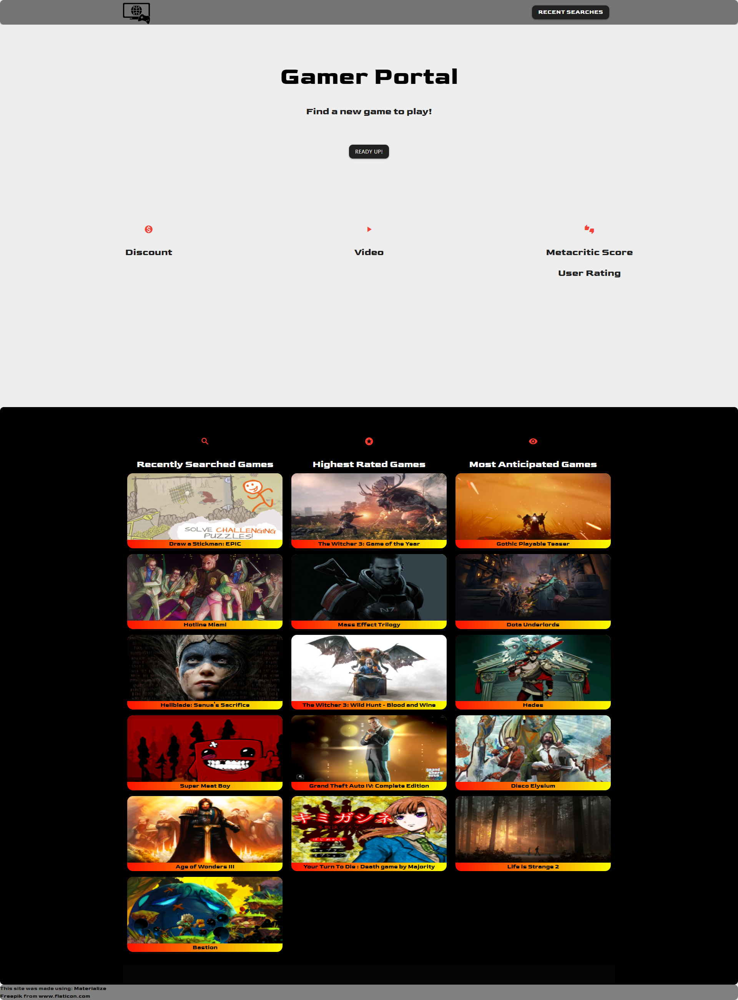

# Gamer Portal

* Gamer Portal is a webpage that utilizes multiple databases to obtain information for those looking to play a new video game.
* Gamer portal allows the user to select a genre of choice.
* After genere is selected a video game from selected genre will be returned as a recomendation.
    - Video clip of the Video Game will be displayed
    - Discount and link to discount for recommended game will be displayed. 
    - Metacritic and User Rating for recommended game will be displayed.
* Gamer portal also allows user to select previously found games again from a list of five of the most recently found games. 
* Users also have the option of selecting a game from a list of highest rated games and most anticipated games. 

## Built With

- HTML
- CSS
- JavaScript
- Luxon (https://moment.github.io/luxon/)
- JQuery (https://jquery.com/)
- Materialize (https://materializecss.com/)
- CheapShark API (https://apidocs.cheapshark.com/)
- RAWG Video Games API (https://rawg.io/apidocs)

### Links

[Deployed application](https://corycalaway.github.io/gamer-portal/)

### Image of Website

